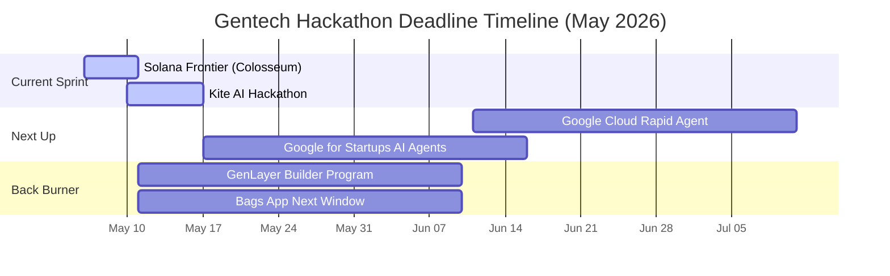

# 🗓️ Active Hackathon Deadlines — May 3 Outlook

> **Last Updated:** 2026-05-03 11:47 UTC | **Source:** `01-Agency/active-hackathons.md`

---

## 🔥 Immediate Deadline Countdown

| Hackathon | Deadline | Days Left | Status | Prize Pool |
|-----------|----------|-----------|--------|------------|
| **Solana Frontier** (Colosseum) | May 11, 2026 | **8** | 🟥 ACTIVE | $125K+ (accel + seed) |
| **Kite AI Hackathon** | May 17, 2026 | **14** | 🟡 PLANNING | $10K |
| ETHGlobal Cannes | Jun 8, 2026 | 36 | 📅 UPCOMING | $150K+ |
| Google Cloud Rapid Agent | Jun 11, 2026 | 39 | 🆕 NEW | $60K |
| Google for Startups AI Agents | Jun 5, 2026 | 33 | 🟡 REGISTERED | $60K + $37.5K GCP |

---

## ✅ Recently Passed / Withdrawn

- **ARC Hackathon** — Withdrawn Apr 22
- **ETHGlobal Open Agents** — Dropped Apr 25 (timeline conflict + portfolio not beginner-friendly)
- **Nous Hermes Creative** — Skipped per Jordan
- **ElevenHacks #6-9** — Skipped per Jordan (focus restraint)

---

## 💰 Total Prize Pipeline

| Phase | Conservative | Aggressive | Notes |
|-------|-------------|------------|-------|
| Active (Solana + Kite) | $30K | $180K | Solana >$125K depends on track selection |
| Upcoming (3 major) | $50K | $325K | ETHGlobal Cannes/NY/Lisbon upcoming |
| Grants (Bags App) | $0 | $4M+ | Next window monitoring |
| AAE Endgame Y1 | $670K | $1.2M+ | Post-hackathon product launch |

**Conservative Total:** ~$750K | **Aggressive Total:** ~$5.9M+

---

*Board auto-updates via `03-Strategies/hackathon-strategy-2026.md` pipeline*
